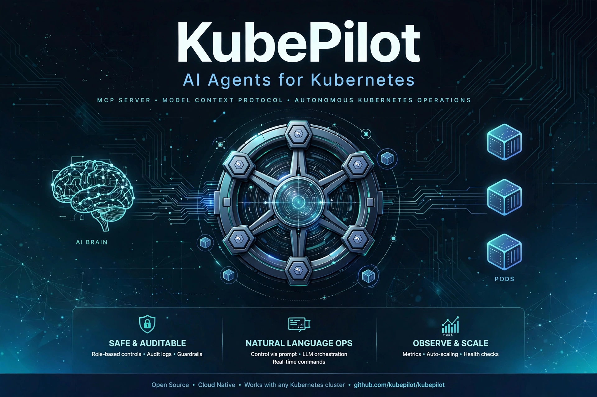

# KubePilot



A **Model Context Protocol (MCP) server** that exposes Kubernetes cluster
operations as tools for AI agents — built with Python, the official
Kubernetes client, and the MCP Python SDK.

Instead of pasting `kubectl` output back and forth, an AI agent connected
to KubePilot can list pods, tail logs, read events, describe resources and
(when explicitly allowed) scale deployments — through a typed,
discoverable tool interface.

## Why this exists

AI coding assistants are becoming operators, not just code generators. But
pointing an agent at a cluster with raw `kubectl` exec is how you get a
3am page: no guardrails, no audit-friendly envelope, no distinction
between "look" and "touch".

KubePilot is a small, opinionated answer to that:

- **Typed tools, not shell strings.** Agents call `list_pods` or
  `get_events`, not `kubectl get ... | jq ...`.
- **Predictable envelopes.** Every tool returns
  `{"ok": true, ...}` or `{"ok": false, "error": "..."}` — agents always
  know what happened.
- **Safety in code, not just docs.** A read-only mode makes mutating tools
  refuse to run, and a namespace allow-list scopes the blast radius.

## Architecture

```
┌─────────────────┐   MCP (stdio)   ┌──────────────┐   kubernetes   ┌───────────┐
│  AI agent host  │ ◄──────────────► │   KubePilot  │ ◄────────────► │  Cluster  │
│ (Claude/Cursor) │   JSON-RPC tools │  MCP server  │   Python client│           │
└─────────────────┘                  └──────────────┘                └───────────┘
                                            │
                              ┌─────────────┴─────────────┐
                              │ config.py  (env settings) │
                              │ k8s.py     (lazy client)  │
                              │ server.py  (6 MCP tools)  │
                              └───────────────────────────┘
```

- `config.py` — all settings from environment variables (12-factor).
- `k8s.py` — lazy `CoreV1Api` / `AppsV1Api` singletons; importing the
  package never needs a live cluster.
- `server.py` — the six MCP tools plus the stdio entry point.

## Tools

| Tool | Kind | What it does |
|---|---|---|
| `list_pods` | read-only | List pods in a namespace, optional label selector; phase, readiness, restarts, age |
| `get_pod_logs` | read-only | Tail a pod's container logs (capped line count) |
| `list_deployments` | read-only | Deployments with desired vs ready/updated/available replicas and images |
| `get_events` | read-only | Recent cluster events, newest first — scheduling, image-pull, probe failures |
| `describe_resource` | read-only | Full manifest (JSON) of a pod, deployment, service, configmap, namespace or node |
| `scale_deployment` | **mutating** | Change a deployment's replica count; returns before/after counts |

Each tool carries a plain-English description so agents can discover when
to use it (see `src/kubepilot/server.py`).

## Prerequisites

- Python 3.10+
- A kubeconfig with access to a cluster (`~/.kube/config` by default,
  or set `KUBEPILOT_KUBECONFIG`) — or run in-cluster with
  `KUBEPILOT_IN_CLUSTER=true`

## Quickstart

```bash
git clone https://github.com/<your-username>/kubepilot.git
cd kubepilot

python3 -m venv .venv && source .venv/bin/activate
pip install -r requirements.txt

# Point at your cluster (or export KUBEPILOT_KUBECONFIG)
kubectl cluster-info

# Run the MCP server (speaks MCP over stdio)
python -m kubepilot
```

### Connect an agent (Claude Desktop example)

Add to your Claude Desktop config (`claude_desktop_config.json`):

```json
{
  "mcpServers": {
    "kubepilot": {
      "command": "/absolute/path/to/kubepilot/.venv/bin/python",
      "args": ["-m", "kubepilot"],
      "env": {
        "KUBEPILOT_KUBECONFIG": "/home/you/.kube/config",
        "KUBEPILOT_READ_ONLY": "true",
        "KUBEPILOT_ALLOWED_NAMESPACES": "default,staging"
      }
    }
  }
}
```

### Docker

```bash
docker build -t kubepilot:latest .
docker run -i --rm \
  -v ~/.kube/config:/root/.kube/config:ro \
  -e KUBEPILOT_READ_ONLY=true \
  kubepilot:latest
```

## Configuration

| Variable | Default | Purpose |
|---|---|---|
| `KUBEPILOT_KUBECONFIG` | `~/.kube/config` | Path to kubeconfig |
| `KUBEPILOT_IN_CLUSTER` | `false` | Use pod service-account auth instead of kubeconfig |
| `KUBEPILOT_ALLOWED_NAMESPACES` | *(unset = all)* | Comma-separated allow-list, e.g. `default,staging` |
| `KUBEPILOT_READ_ONLY` | `false` | When `true`, mutating tools refuse to run |
| `KUBEPILOT_DEFAULT_NAMESPACE` | `default` | Default namespace for tool arguments |
| `KUBEPILOT_MAX_LOG_LINES` | `200` | Cap for `get_pod_logs` tail |
| `KUBEPILOT_LOG_LEVEL` | `INFO` | Python log level |

## Example agent interactions

**Debugging a crash-looping pod:**

> *You:* The checkout API is down in staging, can you take a look?
>
> *Agent:* I'll check the pods and recent events in staging.
> → `list_pods(namespace="staging", label_selector="app=checkout")`
> → `get_pod_logs(pod_name="checkout-7d9f6b4c5-x2kq9", namespace="staging", tail_lines=80)`
>
> *Agent:* Found it — the pod is crash-looping with
> `OOMKilled` in the logs, and the events show the memory limit is
> 256Mi while startup briefly needs more. Want me to describe the
> deployment so we can bump the limit?

**A careful scale-up:**

> *You:* Scale the api deployment in prod to 5 replicas.
>
> *Agent:* → `scale_deployment(name="api", namespace="prod", replicas=5)`
>
> *Agent:* Done — `api` in `prod` went from 3 to 5 replicas.

## Safety notes

- **Read-only by default is one env var away.** For investigation
  workflows, run with `KUBEPILOT_READ_ONLY=true`; `scale_deployment`
  will refuse with a clear error instead of mutating anything.
- **Scope the blast radius.** `KUBEPILOT_ALLOWED_NAMESPACES` keeps every
  namespaced tool inside the namespaces you choose.
- **No secrets in responses.** Tool outputs are trimmed summaries or
  manifests with `managedFields` stripped; nothing is written to disk.
- **Agents are still agents.** Treat this like any privileged
  automation: run it against staging first, review what it does, and
  keep human approval on mutating workflows.

## Development

```bash
pip install -r requirements-dev.txt
python -m pytest tests/ -q        # unit tests (no cluster needed)
python -m compileall -q src/      # syntax check
```

## Roadmap

- [ ] Rollout controls: `restart_deployment`, `rollback_deployment`
- [ ] `port_forward` helper for local debugging sessions
- [ ] Prometheus query tool for correlating metrics with events
- [ ] Policy hooks (e.g. require approval for prod mutations)
- [ ] Helm release visibility (`list_releases`, `get_release_status`)

## License

MIT — see [LICENSE](LICENSE).
